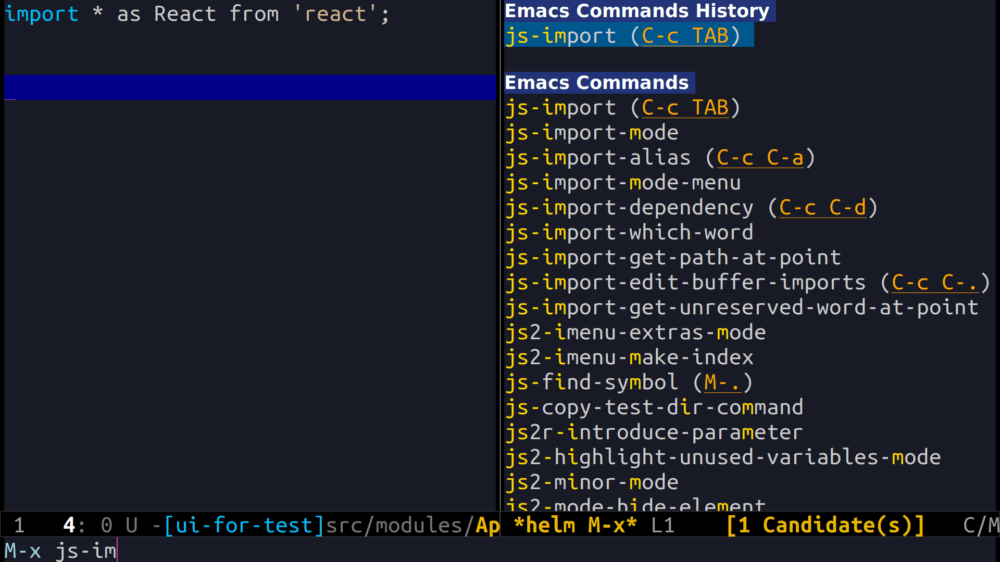

# Table of Contents

-   [js-import](#org314be73)
    -   [Installation](#orgf257d9f)
        -   [straight-use-package](#orga7b8cc6)
        -   [quelpa](#orga9b51ea)
    -   [Commands](#org6dce47f)
    -   [Alias setup](#orgf5279ec)
        -   [tsconfig](#org8f9a533)
        -   [.dir-locals](#org4604c66)
        -   [License](#org87e17ab)

# js-import

An Emacs package for importing JavaScript and TypeScript modules with
[helm](https://github.com/emacs-helm/helm) and [ivy](https://github.com/abo-abo/swiper) (swiper) interface.

A package proposes to select a file or dependency of the current project, extract its exports symbols and inserts an import statement with selected candidates into a buffer.

## Installation

### straight-use-package

Example configuration using package managers [straight](https://github.com/raxod502/straight.el) and [use-package](https://github.com/jwiegley/use-package).

    (use-package js-import
      :straight (:type git
                       :host github
                       :branch "origin/dev-latest"
                       :repo "KarimAziev/js-import"
                       :package "js-import"
                       :local-repo "js-import")
      :commands (js-import-mode)
      :hook ((js-mode . js-import-mode)
             (js2-mode . js-import-mode)
             (typescript-mode . js-import-mode))
      :bind (:map js-import-mode-map
                  ("C-c C-i" . js-import)
                  ("C-c C-j" . js-import-find-symbol-at-point)
                  ("C-c C-." . js-import-symbols-menu)))

### quelpa

    (quelpa '(js-import
            :repo "KarimAziev/js-import"
            :fetcher git
            :url "git@github.com:KarimAziev/js-import.git"))

## Commands

-   **`js-import`:** Main command. Read a filename to extract exports and add selected ones in current buffer.

Addional actions to open or preview are configured for \`helm' and \`ivy'.

-   **`js-import-from-path`:** Make completions with exports from PATH.

Add selected choices to existing or new import statement.

-   **`js-import-mode`:** Turn on/off minor mode
-   **`js-import-replace-relative-imports-to-aliases`:** Convert relative imports to aliased ones.

An exception is made for paths from current buffer directory.

    import { a, b} from '../fileA';
    import { c, d} from './fileB';

transforms to

    import { a, b } from '@/fileA';
    import { c, d } from './fileB';

-   **`js-import-convert-import-path-at-point`:** Replace path of import statement at point to aliased one or relative.

Inside import statement generates completions with available replacements.

-   **`js-import-change-completion`:** Customize or temporarly save one of available completions systems:

\`helm' \`ivy' or default.

-   **`js-import-symbols-menu`:** Jump or refactor to exported, imported and definitions in current buffer.
-   **`js-import-find-file-at-point`:** Find a file when cursor are placed under stringified path.
-   **`js-import-find-file-other-window`:** An action for command \`js-import' to open FILE in other window.
-   **`js-import-find-file`:** An action for command \`js-import' to open FILE.
-   **`js-import-jump-to-definition`:** Deep jump to a definition of symbol at point through re-exports and renamings.
-   **`js-import-reset-all-sources`:** Reset file and symbol sources.
-   **`js-import-reset-cache`:** Remove cache defined in the variables

\`js-import-files-cache' and \`js-import-json-hash'.

## Alias setup

There are two ways to setup file aliases:

### tsconfig

If project root contains the [TSConfig file](https://www.typescriptlang.org/tsconfig#paths) which be either a tsconfig.json or jsconfig.json. Path and baseUrl will be readed automatically.

    {
      "compilerOptions": {
        "baseUrl": ".",
        "paths": {
          "@/*": ["src/*"],
          "UI/*": ["src/components/UI/*"]
        }
      }
    }

### .dir-locals

    ((nil . (
        (eval . (setq js-import-alias-map '("@" "src" "UI" "src/components/UI")))
        )))

Or configure it with \`M-x customize-variable js-import-alias-map\`.

### License

Copyright © 2020 Karim Aziiev.

Distributed under the [GNU General Public License, version 3](http://www.gnu.org/licenses/gpl-3.0.txt)
